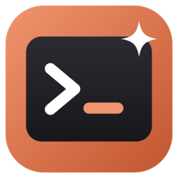

<p align="center"></p>

# Claude Launcher

Open [Claude Code](https://claude.com/claude-code) in any project folder in one keystroke. No more `cd Desktop`, `cd projects`, `cd my-app`, `claude`.

Type a few letters of the project name, press **Enter**, and Claude starts in that folder in a new Windows Terminal tab. Every session goes into the same terminal window as tabs, unless you ask for a new window.

  

## Features

- **Most used on top.** Projects are sorted by how often you open them, then by how recently.
- **Pin favorites.** Pinned projects stay at the very top no matter what.
- **One terminal window.** Each launch adds a tab to the same Windows Terminal window. **Ctrl+Enter** or **New window** opens a separate one when you want it.
- **Any folder.** Every folder inside `Desktop\projects` is listed automatically, and **Add folder** adds any other folder on your PC.
- **Keyboard first.** Type to search, arrows to move, Enter to launch. The mouse works too.
- **Automatic updates.** New releases download in the background and install when you restart or close the app.
- **One copy, always.** Opening it again brings the running window back instead of starting a second copy.

## Install

Download `ClaudeLauncher-win-Setup.exe` from the [latest release](https://github.com/dahbimoad/ClaudeLauncher/releases/latest) and run it. It installs for your user only (no admin prompt) and adds a Desktop and Start Menu shortcut. Uninstall any time from *Settings > Apps*.

The installer is not code signed, so Windows SmartScreen may warn once: **More info > Run anyway**.

**Requirements:** Windows 10 or 11, [Windows Terminal](https://aka.ms/terminal), [PowerShell 7](https://aka.ms/powershell) (`pwsh`) and [Claude Code](https://claude.com/claude-code) (`claude` on your PATH). The installer adds the .NET 10 Desktop Runtime if it is missing.

## Usage

| Action | Keys / mouse |
| --- | --- |
| Open Claude in a new tab | **Enter**, double-click, or **Open Claude** |
| Open Claude in a new terminal window | **Ctrl+Enter** or **New window** |
| Pin or unpin a project | **Ctrl+P**, or click the pin on the row |
| Clear the search | **Esc** |
| Show in Explorer, remove an added folder | Right-click a project |

When Claude exits, the tab stays open as a PowerShell prompt in that project folder.

Your pins, added folders and usage counts are stored in `%APPDATA%\ClaudeLauncher\state.json`.

## Build from source

Requires the [.NET 10 SDK](https://dotnet.microsoft.com/download) and [Velopack](https://velopack.io) (`dotnet tool install -g vpk`).

```powershell
git clone https://github.com/dahbimoad/ClaudeLauncher.git
cd ClaudeLauncher
dotnet run                 # run it
.\build-installer.ps1      # build Releases\ClaudeLauncher-win-Setup.exe
```

## License

[MIT](LICENSE) © Moad Dahbi

Built and published by [iSoutien](https://isoutien.com).
